<p align="center">
  
</p>

# 🚀 Top Viral Repositories 🌟: Top 20 Trending Open-Source GitHub Projects (2026) 📈

<p align="center">
  <a href="https://github.com/ishandutta2007/Awesome-Awesome-Awesome"></a>
  <a href="https://discord.gg/jc4xtF58Ve"></a>
  <a href="https://github.com/ishandutta2007/Top-Viral-Repositories/stargazers"></a>
  <a href="https://github.com/ishandutta2007/Top-Viral-Repositories/network/members"></a>
  <a href="https://github.com/ishandutta2007/Top-Viral-Repositories/issues"></a>
  <a href="https://github.com/ishandutta2007/Top-Viral-Repositories/pulls"></a>
  
  
  <a href="https://github.com/ishandutta2007"></a>
</p>

✨ A curated directory of the **fastest-growing and top viral open-source GitHub repositories in 2026**! 🌐 Discover cutting-edge innovations across **🤖 Autonomous AI Agents**, **⚡ Local LLM Serving**, **🔍 Retrieval-Augmented Generation (RAG)**, **💻 Agentic Developer Workflows**, and **🎨 Generative AI Systems**.

---

## 📌 Table of Contents 📑

- [🔥 Top 20 Viral GitHub Repositories (Ranked by Stars)](#-top-20-viral-github-repositories-ranked-by-stars)
- 📂 **Categorized Niche Directories (20 Repositories Each)**:
  1. [🤖 Local AI Assistant & Personal Agent](categories/local-ai-assistants.md)
  2. [🛠️ Agentic Developer Workflows & Standards](categories/agentic-developer-workflows.md)
  3. [⚡ Local LLM Runner & Model Serving](categories/local-llm-serving.md)
  4. [🌐 Web Scraping & Data Extraction API](categories/web-scraping-data-extraction.md)
  5. [🧩 Agent Workflow Orchestration & RAG](categories/agent-workflow-orchestration.md)
  6. [💻 Self-Hosted AI Interface & Workspace](categories/self-hosted-ai-interfaces.md)
  7. [🎨 Modular Generative AI & Diffusion GUI](categories/generative-ai-diffusion.md)
  8. [🚀 High-Throughput & Low-Latency LLM Serving](categories/high-throughput-llm-serving.md)
  9. [📑 Document Understanding & RAG Engine](categories/document-understanding-rag.md)
  10. [📚 All-in-One Local RAG & Document AI](categories/all-in-one-local-rag.md)
  11. [🕷️ Open-Source LLM-Friendly Web Crawler](categories/llm-web-crawlers.md)
  12. [🎓 ML Education & Minimalist LLM Pipeline](categories/ml-education-llm-pipelines.md)
  13. [🔄 Unified LLM Proxy & Gateway](categories/llm-proxies-gateways.md)
  14. [🕸️ Multi-Agent Coordination Framework](categories/multi-agent-coordination.md)
  15. [👥 Multi-Agent Conversation Framework](categories/multi-agent-conversation.md)
  16. [🎛️ In-App AI Agents & Copilots Framework](categories/in-app-ai-agents.md)
  17. [🧠 Personal AI Second Brain & Offline Assistant](categories/personal-ai-second-brain.md)
  18. [🛡️ Supply Chain Security & Dependency Auditing](categories/security-dependency-auditing.md)
  19. [💻 CLI Coding Assistant & Automation](categories/cli-coding-assistants.md)
  20. [🚨 Automated Penetration Testing & Cybersecurity](categories/penetration-testing-cybersecurity.md)
- [📂 Categorized Repository Index](#-categorized-repository-index)
- [💡 Frequently Asked Questions (FAQ)](#-frequently-asked-questions-faq)
- [🏷️ Trending Tags & Keywords](#️-trending-tags--keywords)
- [⭐ Star History](#-star-history)
- [🔄 Sorting Tables by Stars](#-sorting-tables-by-stars)
- [🛠️ Contributing & Submissions](#️-contributing--submissions)
- [📄 License](#-license)

---

## 🔥 Top 20 Viral GitHub Repositories (Ranked by Stars) 🏆

| 🏅 Rank | 📦 Repository & Stars | 🏷️ Niche / Category | 💡 Key Highlights |
|:---:|---|---|---|
| 🥇 1 | **OpenClaw** [](https://github.com/openclaw/openclaw/stargazers) | [🤖 Local AI Assistant & Personal Agent](categories/local-ai-assistants.md) | 📱 Self-hosted assistant integrating with messaging apps (WhatsApp, Signal, Discord) to run commands and create dynamic skills locally. |
| 🥈 2 | **skills (by Matt Pocock)** [](https://github.com/mattpocock/skills/stargazers) | [🛠️ Agentic Developer Workflows & Standards](categories/agentic-developer-workflows.md) | 📐 Structured behaviors and repeatable workflow templates to guide AI coding agents toward clean, reliable code. |
| 🥉 3 | **Ollama** [](https://github.com/ollama/ollama/stargazers) | [⚡ Local LLM Runner & Model Serving](categories/local-llm-serving.md) | 🦙 Lightweight framework to get up and running with open-weights LLMs locally via simple CLI and REST APIs. |
| 4 | **Firecrawl** [](https://github.com/mendableai/firecrawl/stargazers) | [🌐 Web Scraping & Data Extraction API](categories/web-scraping-data-extraction.md) | 🔥 AI-first web scraper that cleanly parses websites and dynamic content directly into markdown for LLM ingestion. |
| 5 | **Dify** [](https://github.com/langgenius/dify/stargazers) | [🧩 Agent Workflow Orchestration & RAG](categories/agent-workflow-orchestration.md) | 📊 Visual development platform for enterprise RAG, visual prompt chaining, and fast model orchestration. |
| 6 | **Open WebUI** [](https://github.com/open-webui/open-webui/stargazers) | [💻 Self-Hosted AI Interface & Workspace](categories/self-hosted-ai-interfaces.md) | 💬 User-friendly, extensible web interface for local and remote LLMs with multimodal chat, pipelines, and RAG support. |
| 7 | **ComfyUI** [](https://github.com/comfyanonymous/ComfyUI/stargazers) | [🎨 Modular Generative AI & Diffusion GUI](categories/generative-ai-diffusion.md) | 🖼️ Powerful, modular node-based graph UI for constructing advanced image, video, and audio generative pipelines. |
| 8 | **Codex** [](https://github.com/openai/codex/stargazers) | [💻 CLI Coding Assistant & Automation](categories/cli-coding-assistants.md) | ⚡ High-ROI terminal agent designed for token-efficient debugging, multi-file refactoring, and autonomous coding loops. |
| 9 | **vLLM** [](https://github.com/vllm-project/vllm/stargazers) | [🚀 High-Throughput & Low-Latency LLM Serving](categories/high-throughput-llm-serving.md) | ⚡ Production-ready inference and serving engine utilizing PagedAttention for maximum throughput and memory efficiency. |
| 10 | **RAGFlow** [](https://github.com/infiniflow/ragflow/stargazers) | [📑 Document Understanding & RAG Engine](categories/document-understanding-rag.md) | 🧠 Deep document intelligence engine optimized for parsing complex, unstructured documents with citation grounding. |
| 11 | **Crawl4AI** [](https://github.com/unclecode/crawl4ai/stargazers) | [🕷️ Open-Source LLM-Friendly Web Crawler](categories/llm-web-crawlers.md) | ⚡ Ultra-fast, lightweight web crawler designed specifically for LLMs, agentic extraction pipelines, and clean markdown output. |
| 12 | **AnythingLLM** [](https://github.com/Mintplex-Labs/anything-llm/stargazers) | [📚 All-in-One Local RAG & Document AI](categories/all-in-one-local-rag.md) | 🔒 Self-hosted, private desktop and server application to chat with documents, enterprise connectors, and custom workspaces. |
| 13 | **AutoGen** [](https://github.com/microsoft/autogen/stargazers) | [👥 Multi-Agent Conversation Framework](categories/multi-agent-conversation.md) | 🤝 Multi-agent framework enabling collaborative, autonomous agent systems that communicate to solve complex workflows. |
| 14 | **Striks** [](https://github.com/usestrix/strix/stargazers) | [🚨 Automated Penetration Testing & Cybersecurity](categories/penetration-testing-cybersecurity.md) | ⚔️ Autonomous red-team multi-agent framework to scan, exploit, and document code vulnerabilities. |
| 15 | **nanochat (by Andrej Karpathy)** [](https://github.com/karpathy/nanochat/stargazers) | [🎓 ML Education & Minimalist LLM Pipeline](categories/ml-education-llm-pipelines.md) | 🧪 Minimalist, end-to-end LLM training pipeline detailing tokenization, fine-tuning, and chat deployment in clean code. |
| 16 | **LiteLLM** [](https://github.com/BerriAI/litellm/stargazers) | [🔄 Unified LLM Proxy & Gateway](categories/llm-proxies-gateways.md) | 🛡️ OpenAI-compatible proxy interface to manage, load-balance, and call 100+ LLMs with unified keys and budget tracking. |
| 17 | **LangGraph** [](https://github.com/langchain-ai/langgraph/stargazers) | [🕸️ Multi-Agent Coordination Framework](categories/multi-agent-coordination.md) | 🔄 Library for designing cyclical, stateful agent behaviors, self-correcting routines, and multi-agent coordination. |
| 18 | **CopilotKit** [](https://github.com/CopilotKit/CopilotKit/stargazers) | [🎛️ In-App AI Agents & Copilots Framework](categories/in-app-ai-agents.md) | ⚛️ Framework to easily integrate generative UI, embedded copilots, and autonomous AI agents directly into web applications. |
| 19 | **Khoj** [](https://github.com/khoj-ai/khoj/stargazers) | [🧠 Personal AI Second Brain & Offline Assistant](categories/personal-ai-second-brain.md) | 🔍 Local-first AI assistant to search, reason, and chat with notes, documents, images, and codebases privately. |
| 20 | **Bumblebee (by Perplexity AI)** [](https://github.com/perplexityai/bumblebee/stargazers) | [🛡️ Supply Chain Security & Dependency Auditing](categories/security-dependency-auditing.md) | 🔎 Read-only security scanner to detect malicious packages and nested supply-chain risks across codebases. |

---

## 📂 Categorized Repository Index 🗂️

### 🤖 AI Agents & Workflow Orchestration
- 🧩 **[Dify](https://github.com/langgenius/dify)** – Comprehensive visual platform for building production RAG and autonomous agent workflows.
- 🕸️ **[LangGraph](https://github.com/langchain-ai/langgraph)** – Cyclic, multi-actor state machines for reliable, long-running agent execution.
- 👥 **[AutoGen](https://github.com/microsoft/autogen)** – Microsoft's multi-agent conversational framework for collaborative problem solving.
- 🛠️ **[skills](https://github.com/mattpocock/skills)** – Modular agent behavior blueprints and engineering workflows for AI coding assistants.

### ⚡ Local LLM Runners & High-Throughput Inference
- 🦙 **[Ollama](https://github.com/ollama/ollama)** – Quick and easy local model execution across macOS, Linux, and Windows.
- 🚀 **[vLLM](https://github.com/vllm-project/vllm)** – High-performance LLM serving engine powered by PagedAttention.
- 🔄 **[LiteLLM](https://github.com/BerriAI/litellm)** – Universal proxy gateway to unify 100+ LLM providers with load balancing and fallbacks.

### 🔍 RAG, Search & Data Extraction Pipelines
- 🔥 **[Firecrawl](https://github.com/mendableai/firecrawl)** – Turn any website or dynamic web app into clean, LLM-ready markdown.
- 🕷️ **[Crawl4AI](https://github.com/unclecode/crawl4ai)** – Open-source, asynchronous web scraping built from the ground up for LLMs.
- 📑 **[RAGFlow](https://github.com/infiniflow/ragflow)** – Deep document intelligence and retrieval engine with citation grounding.
- 📚 **[AnythingLLM](https://github.com/Mintplex-Labs/anything-llm)** – All-in-one private desktop and server application for chatting with documents.

### 🎨 Generative UI, Diffusion & Assistants
- 📱 **[OpenClaw](https://github.com/openclaw/openclaw)** – Privacy-first personal assistant integrating local actions and instant messaging.
- 💬 **[Open WebUI](https://github.com/open-webui/open-webui)** – Feature-complete self-hosted AI interface for Ollama, OpenAI, and custom pipelines.
- 🖼️ **[ComfyUI](https://github.com/comfyanonymous/ComfyUI)** – Node-based GUI for building modular Stable Diffusion and generative media pipelines.
- 🎛️ **[CopilotKit](https://github.com/CopilotKit/CopilotKit)** – React UI components and backend SDKs to build in-app AI copilots.
- 🧠 **[Khoj](https://github.com/khoj-ai/khoj)** – Offline-first personal second brain that indexes notes, research, and local files.

### 🛡️ Security, Auditing & Educational Tooling
- 🔎 **[Bumblebee](https://github.com/perplexityai/bumblebee)** – Perplexity's read-only security auditor for developer machines and dependencies.
- ⚔️ **[Striks](https://github.com/usestrix/strix)** – Autonomous red-team penetration testing and vulnerability analysis.
- 🎓 **[nanochat](https://github.com/karpathy/nanochat)** – Andrej Karpathy's minimalist educational guide to training and serving LLMs.
- 💻 **[Codex](https://github.com/openai/codex)** – Terminal coding assistant for automated debugging and refactoring loops.

---

## 💡 Frequently Asked Questions (FAQ) ❓

<details>
<summary><b>1. 🏅 How are the viral repositories ranked in this list?</b></summary>
Repositories are ordered in real-time by total GitHub stars count in descending order. The star badges are dynamically generated via Shields.io and link directly to each project's stargazers page.
</details>

<details>
<summary><b>2. 🚀 Why are local-first AI and AI agents dominating GitHub in 2026?</b></summary>
Developers and enterprises are prioritizing privacy, cost reduction, and autonomy. Self-hosted LLM runners (like Ollama and vLLM) and multi-agent coordination frameworks (like LangGraph and AutoGen) enable powerful automated systems without lock-in to proprietary cloud APIs.
</details>

<details>
<summary><b>3. 📥 How can I submit a new trending repository to this list?</b></summary>
Open a pull request following our contribution guide below. Ensure the project is open-source, actively maintained, and brings distinct value to the developer or AI ecosystem.
</details>

---

## 🏷️ Trending Tags & Keywords 🔖

`#ai-agents` `#open-source-ai` `#local-llm` `#rag` `#autonomous-agents` `#ollama` `#vllm` `#generative-ai` `#web-scraping` `#trending-repositories` `#github-stars` `#developer-tools` `#privacy-first` `#comfyui` `#langgraph`

---

## ⭐ Star History

[](https://star-history.dera.page/#ishandutta2007/Top-Viral-Repositories&type=date&legend=top-left)

---

## 🔄 Sorting Tables by Stars 📊

Use the included [`sort_tables.py`](sort_tables.py) script to automatically fetch live star counts via GitHub API, sort rows in descending order, and re-rank tables across `README.md` and category files.

### 🚀 Usage

- **Sort the main table in `README.md` (default)**:
  ```bash
  python sort_tables.py
  ```

- **Sort a specific category markdown file**:
  ```bash
  python sort_tables.py categories/cli-coding-assistants.md
  ```

- **Sort multiple category files or all files**:
  ```bash
  python sort_tables.py categories/*.md
  ```

- **Force fresh fetch from GitHub API (bypass 24h cache)**:
  ```bash
  python sort_tables.py --refresh
  ```

> [!NOTE]
> **24-Hour Local Cache**: Star counts are cached in `.star_cache.json` for 24 hours to minimize API calls and avoid GitHub rate limits. If data was fetched within the last 24 hours, the local cache will be used automatically.

> [!TIP]
> **GitHub Authentication & Rate Limits**: `sort_tables.py` automatically reads `GITHUB_TOKEN` from [`.env`](.env) if present. If `.env` is not found or empty, it will fall back to environment variables or unauthenticated requests.
> ```env
> # .env
> GITHUB_TOKEN="your_personal_access_token"
> ```

---

## 🛠️ Contributing & Submissions 🤝

We welcome contributions from the community! If you've created or discovered an open-source tool that should be featured:

1. 🍴 **Fork** this repository.
2. 🌿 Create your branch (`git checkout -b feature/nominate-repo`).
3. 📝 Add your entry to the appropriate category table in `categories/` or the top list in `README.md`.
4. 🔄 Run `python sort_tables.py [file]` to ensure table rows are sorted and ranked properly.
5. 🚀 Open a **Pull Request** with a brief summary of the tool and its utility.

---

## 📄 License 📜

This repository is licensed under the [MIT License](LICENSE). Feel free to share, fork, and adapt! 🎉


